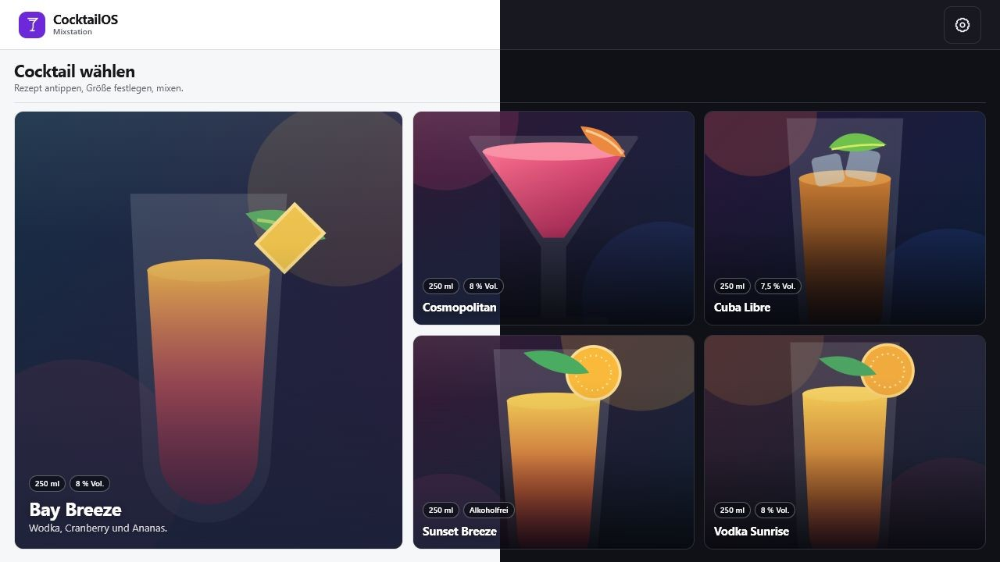
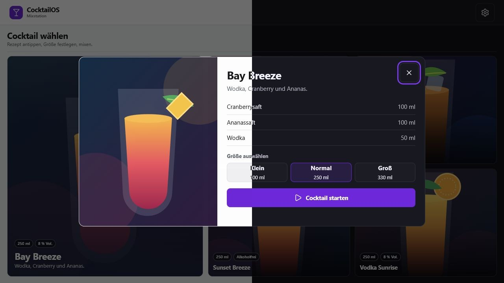
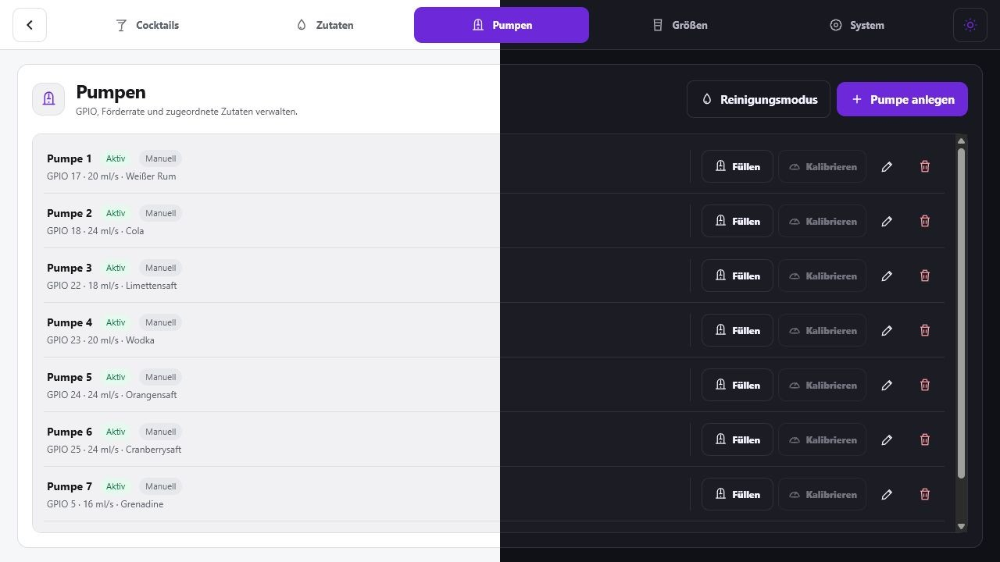

# CocktailOS Kiosk

> **Direkt auf dem Raspberry Pi installieren**

```bash
curl -fsSL https://raw.githubusercontent.com/CocktailOS/Kiosk/main/install.sh | sudo bash
```

CocktailOS Kiosk ist eine lokale Cocktail-Mixstation für Raspberry Pi und 7-Zoll-Touchdisplays (1024 × 600). Sie verwaltet Rezepte, Zutaten, Pumpen und Bestände, steuert den Ausschank und bleibt im normalen Betrieb vollständig ohne Internet nutzbar.



## Auf einen Blick

- Touch-optimierte Oberfläche für Cocktailauswahl, Größe und Ausschank
- Bis zu acht parallel steuerbare Pumpen – im sicheren Dummy-Modus oder über Raspberry-Pi-GPIO
- Automatischer Bestandsabzug, Auffüllen und Verfügbarkeitsprüfung vor dem Mixen
- Geführte Ersteinrichtung inklusive interaktiver Tour durch die komplette Oberfläche
- Vierstelliger App-PIN für die Adminansicht; derselbe PIN schützt optional auch den Netzwerkzugriff
- Lokale Datensicherung und Wiederherstellung als ZIP-Datei – auch ohne Internet
- Einheitliche, lokal eingebundene Lucide-Icons – keine externen Icon-Downloads im Kiosk-Betrieb
- Release-Updates direkt aus der Systemansicht oder über das Installationsskript

## Screenshots

Jeder Screenshot zeigt die aktuelle Lucide-Iconografie: links den Light Mode, rechts den Dark Mode.

| Cocktail auswählen | Größe wählen und starten |
| --- | --- |
|  |  |

Die Pumpenverwaltung bündelt GPIO-Zuordnung, Kalibrierung, Schlauchfüllung und Reinigungsmodus in einer Ansicht.



## Installation auf dem Raspberry Pi

Das Installationsskript lädt die passende ARM64-Release, prüft deren Prüfsumme, richtet systemd ein und bewahrt bei späteren Updates Datenbank sowie hochgeladene Bilder. Im Display-Modus installiert es außerdem Cage und Chromium für den Kiosk-Betrieb und konfiguriert 1024 × 600 HDMI.

### Mit angeschlossenem Display

```bash
curl -fsSL https://raw.githubusercontent.com/CocktailOS/Kiosk/main/install.sh | sudo bash
sudo reboot
```

Nach dem Neustart startet CocktailOS automatisch auf dem angeschlossenen Display. Der Zugriff aus dem lokalen Netzwerk ist zunächst deaktiviert.

### Headless oder über das Netzwerk

```bash
curl -fsSL https://raw.githubusercontent.com/CocktailOS/Kiosk/main/install.sh | sudo bash -s -- --headless --network-pin 1234
```

Ersetze `1234` durch einen eigenen vierstelligen PIN. Im Headless-Modus ist der Netzwerkzugriff aktiv und die Anwendung anschließend unter `http://<IP-des-Pi>:5149` erreichbar. Der PIN wird als Hash gespeichert und ist zugleich der App-PIN für die Adminansicht.

Weitere Optionen:

```text
--tag TAG     Bestimmte Release-Version installieren
--stable      Vorabversionen bei der Auswahl ignorieren
--headless    Ohne Display installieren
```

## Funktionen

### Cocktails und Ausschank

- Cocktailkarten mit Bild, Beschreibung, Zutaten und verfügbaren Größen
- Mengen werden für die gewählte Größe proportional berechnet
- Animierter Ausschank mit Fortschritt, sicherem Sofort-Stopp und Rückmeldung
- Mehrere Pumpen können gleichzeitig laufen; bei Fehler oder Abbruch werden alle Ausgänge sicher abgeschaltet
- Nicht verfügbare Zutaten oder zu geringe Bestände blockieren den Start

### Zutaten und Bestand

- Zutaten mit Flaschengröße, Restmenge und Warnung bei niedrigem Bestand
- Bestände werden nach erfolgreichem Ausschank automatisch reduziert
- Bei Abbruch wird der Verbrauch anhand der tatsächlichen Laufzeit anteilig abgezogen
- Auffüllen direkt in der Zutatenverwaltung

### Pumpen und Hardware

- Bis zu acht Pumpen mit GPIO-Pin, Förderrate, Zutat und aktivem Status
- Dummy-Treiber zum sicheren Einrichten und Testen ohne angeschlossene Hardware
- Raspberry-Pi-GPIO-Treiber über `System.Device.Gpio`
- Pro Pumpe einstellbare Relaispolarität (active HIGH oder active LOW)
- Kalibrierassistent mit Messlauf und Kontrollmessungen
- Schlauchfüllung per Gedrückthalten sowie Reinigungsmodus mit Laufzeit und Sofort-Stopp

### Administration und Betrieb

- Geführte Intro-Tour beim ersten Start: Startseite, Cocktails, Zutaten, Pumpen, Größen und System werden direkt in der echten UI erklärt
- Nach der Tour wird ein vierstelliger App-PIN festgelegt
- Die PIN-Abfrage erscheint bei jedem Öffnen der Adminansicht; während der Tour sind nur die vorgesehenen Schritte bedienbar
- Einstellungen werden automatisch gespeichert
- Optionaler Netzwerkzugriff im vertrauenswürdigen lokalen Netz, geschützt durch denselben PIN
- Installierte Version, Update-Prüfung und Tour-Wiederholung in der Systemansicht

### Backup und Wiederherstellung

- Backup als ZIP mit SQLite-Datenbank und allen hochgeladenen Cocktailbildern
- Wiederherstellung direkt aus der Systemansicht
- Vor dem Wiederherstellen wird der aktuelle Stand als Sicherheitskopie abgelegt
- Kein Cloud-Konto und kein Internetzugang nötig: Die ZIP-Datei kann z. B. über den Browser vom Pi heruntergeladen oder auf einen USB-Stick kopiert werden

## Erster Start

1. Die Intro-Tour führt durch die Bedienung und die wichtigsten Verwaltungsfunktionen.
2. Nach Abschluss wird ein vierstelliger App-PIN vergeben.
3. In **Einstellungen** Cocktails, Zutaten, Pumpen und Größen einrichten.
4. Für echte Hardware unter **System** von **Dummy** auf **Raspberry Pi GPIO** umstellen.
5. Pumpen kalibrieren, Schläuche füllen und anschließend einen Cocktail auswählen.

## App-PIN auf dem Pi ändern oder zurücksetzen

Direkt am Raspberry Pi (per Terminal oder SSH) lässt sich der PIN ändern:

```bash
sudo cocktailos-change-pin
```

Der Befehl fragt den neuen vierstelligen PIN zweimal verdeckt ab, aktualisiert ihn in der lokalen Datenbank und startet CocktailOS wieder. Derselbe neue PIN gilt anschließend auch für den Netzwerkzugriff.

Falls der PIN komplett gelöscht und anschließend in der UI neu vergeben werden soll:

```bash
sudo cocktailos-reset-pin
```

Nach der Bestätigung mit `LOESCHEN` startet CocktailOS inklusive der Kiosk-Ansicht neu und zeigt unmittelbar die PIN-Einrichtung. Der Netzwerkzugriff wird dabei zur Sicherheit deaktiviert; er kann nach dem neuen PIN wieder in **System** aktiviert werden.

## Datensicherung vom Pi holen

Öffne auf einem Gerät im selben Netzwerk `http://<IP-des-Pi>:5149`, entsperre die Adminansicht und gehe zu **System → Datensicherung**. Mit **Backup herunterladen** erhältst du eine ZIP-Datei mit Datenbank und Bildern.

Alternativ lässt sich die Datei bei einem lokalen Bildschirm direkt über den Browser herunterladen und anschließend auf einen USB-Stick kopieren. Für die Wiederherstellung wird dieselbe ZIP-Datei über **Backup wiederherstellen** ausgewählt.

## Hardware und Sicherheit

> GPIO-Pins dürfen Pumpen oder Relais niemals direkt mit Strom versorgen. GPIO ist ausschließlich das Steuersignal für ein geeignetes Relais- oder Treibermodul. Plane eine ausreichend dimensionierte, separat abgesicherte Spannungsversorgung für die Pumpen ein.

| Treiber | Einsatz |
| --- | --- |
| **Dummy** | Simuliert Schaltvorgänge. Ideal für Entwicklung, UI-Test und Einrichtung ohne Hardware. |
| **Raspberry Pi GPIO** | Steuert Relais über `System.Device.Gpio` auf dem Raspberry Pi. |

Bei Stopp, Abbruch und Fehlern setzt CocktailOS alle geöffneten Pumpenausgänge in den inaktiven Zustand.

## Daten, Updates und Offline-Betrieb

| Inhalt | Standardort auf dem Pi |
| --- | --- |
| SQLite-Datenbank | `/var/lib/cocktailos-kiosk/data/cocktailos.db` |
| Hochgeladene Bilder | `/var/lib/cocktailos-kiosk/uploads/` |
| Releases | `/opt/cocktailos-kiosk/releases/` |

Der tägliche Betrieb, die UI, die PIN-Prüfung und Backups funktionieren ohne Internetzugang. Nur Installation, Update-Prüfung und Download einer neuen Release benötigen Zugriff auf GitHub.

## Lokal entwickeln

Voraussetzung: .NET SDK 10.

```powershell
dotnet tool restore
dotnet restore
dotnet run --project CocktailOS.Kiosk/CocktailOS.Kiosk.csproj
```

Die Anwendung ist anschließend standardmäßig unter `http://localhost:5276` erreichbar. Beim ersten Start werden Migrationen angewendet und Demo-Daten angelegt.

### Prüfen und bauen

```powershell
dotnet test CocktailOS.Kiosk.slnx -c Release --no-restore
dotnet build CocktailOS.Kiosk/CocktailOS.Kiosk.csproj -c Release
```

Im Development-Modus ist die OpenAPI-Beschreibung unter `/openapi/v1.json` verfügbar.

## Projektstruktur

```text
CocktailOS.Kiosk/
├── Contracts/    API-Request- und Response-Modelle
├── Data/         EF-Core-Kontext, Migrationen und Demo-Daten
├── Endpoints/    Minimal-API-Routen und Validierung
├── Models/       Datenbankentitäten
├── Services/     Ausschank, Backup sowie Dummy- und GPIO-Treiber
└── wwwroot/      Kiosk-Oberfläche, lokale Assets und Uploads
```
