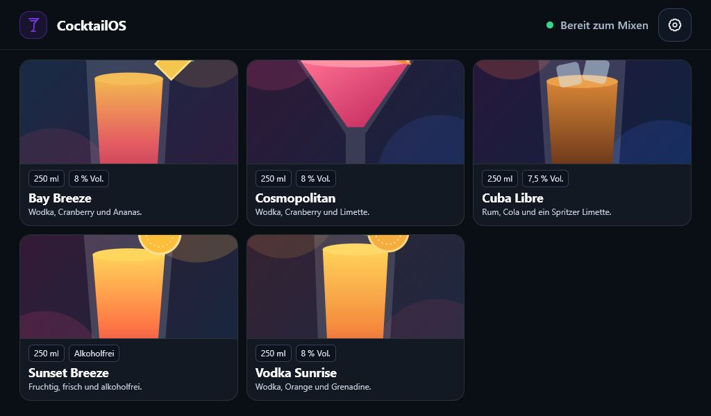
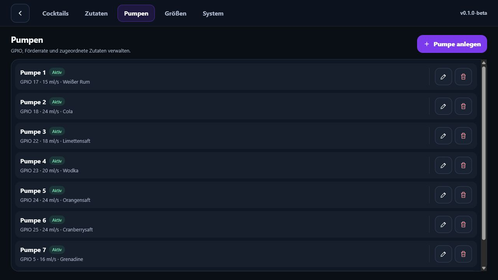

# CocktailOS Kiosk

CocktailOS Kiosk ist eine .NET-10-Minimal-API mit einer für einen 7-Zoll-Touchscreen (1024 × 600) optimierten Oberfläche. Die Anwendung verwaltet Cocktails, Zutaten, Größen und Pumpen und steuert den Ausschank über einen sicheren Dummy- oder Raspberry-Pi-GPIO-Treiber.



## Funktionen

- Cocktailauswahl mit Bildern, Größen und proportional skalierbaren Rezepten
- Animierter Ausschank mit Fortschritt, Stopp-Schaltfläche und Erfolgsrückmeldung
- Verwaltung von Cocktails, Zutaten, Pumpen, Größen und Systemkonfiguration in Dialogen
- Bis zu acht parallele Pumpen
- Je Pumpe konfigurierbare GPIO-Nummer, Förderrate und active-HIGH-/active-LOW-Relaislogik
- Dummy-Treiber zum sicheren Testen ohne angeschlossene Hardware
- SQLite-Datenbank mit Entity Framework Core und automatischen Migrationen beim Start
- Bild-Upload für Cocktails; Dateien werden lokal auf dem Gerät gespeichert
- Vanilla JavaScript, CSS und lokal eingebundenes GSAP – kein Node.js und kein Internetzugang im Betrieb nötig

## Screenshots

### Startseite

Die Startseite zeigt bis zu sechs Cocktails in zwei Reihen. Weitere Cocktails lassen sich horizontal erreichen. Über das Zahnrad in der Kopfzeile öffnen sich die Einstellungen.


### Pumpenverwaltung

Die Einstellungen bündeln technische Details und Aktionen übersichtlich in einer Zeile. Status, GPIO-Pin, Förderrate und zugeordnete Zutat sind sofort erkennbar.



## Voraussetzungen

- .NET SDK 10
- Für echten GPIO-Betrieb: Raspberry Pi mit unterstütztem Linux-System, Relaisboard und korrekt abgesicherter Pumpenstromversorgung

> Die Relais und Pumpen dürfen nicht direkt über GPIO-Pins versorgt werden. GPIO dient ausschließlich als Steuersignal für ein geeignetes Relais- oder Treibermodul.

## Lokal starten

```powershell
dotnet tool restore
dotnet restore
dotnet run --project CocktailOS.Kiosk/CocktailOS.Kiosk.csproj
```

Die Anwendung ist anschließend standardmäßig unter `http://localhost:5276` erreichbar. Beim ersten Start werden die EF-Core-Migrationen angewendet und Demo-Daten erzeugt.

## Installation auf dem Raspberry Pi

Das Installationsskript lädt die aktuelle ARM64-Release, prüft deren Prüfsumme, richtet den systemd-Dienst ein und erhält bei Updates die SQLite-Datenbank sowie hochgeladene Bilder. Für die Display-Modi wird der Bildschirm auf 1024 × 600 konfiguriert. Nach der ersten Installation ist ein Neustart erforderlich.

### Nur Netzwerkzugriff

Startet ausschließlich die API; die Oberfläche ist im lokalen Netzwerk erreichbar.

```bash
curl -fsSL https://raw.githubusercontent.com/CocktailOS/Kiosk/main/install.sh | sudo bash -s -- --headless
```

### Nur lokales Display

Startet die Oberfläche auf dem angeschlossenen Bildschirm. Die API ist dabei nur lokal auf dem Raspberry Pi erreichbar.

```bash
curl -fsSL https://raw.githubusercontent.com/CocktailOS/Kiosk/main/install.sh | sudo bash -s -- --display
```

### Display und Netzwerkzugriff

Startet die Oberfläche auf dem Display und stellt die API zusätzlich im lokalen Netzwerk bereit.

```bash
curl -fsSL https://raw.githubusercontent.com/CocktailOS/Kiosk/main/install.sh | sudo bash -s -- --both
```

### Reduziertes Leistungsprofil

Für leistungsschwächere Raspberry-Pi-Modelle kann der Display- oder Kombimodus mit einem reduzierten Profil installiert werden:

```bash
curl -fsSL https://raw.githubusercontent.com/CocktailOS/Kiosk/main/install.sh | sudo bash -s -- --both --low-performance
```

`--low-performance` ist nur zusammen mit `--display` oder `--both` gültig. Nach einer Installation mit Display bitte einmal neu starten:

```bash
sudo reboot
```

## Daten und Bilder

| Inhalt | Speicherort |
| --- | --- |
| SQLite-Datenbank | `CocktailOS.Kiosk/data/cocktailos.db` |
| Hochgeladene Cocktailbilder | `CocktailOS.Kiosk/wwwroot/uploads/` |
| Statische Beispielbilder | `CocktailOS.Kiosk/wwwroot/assets/` |

Die Datenbankverbindung ist in [`appsettings.json`](CocktailOS.Kiosk/appsettings.json) konfigurierbar:

```json
{
  "ConnectionStrings": {
    "CocktailOs": "Data Source=data/cocktailos.db"
  }
}
```

## Bedienung

1. Auf der Startseite einen Cocktail wählen.
2. Im Dialog die gewünschte Größe auswählen.
3. Zutatenverhältnis prüfen und den Ausschank starten.
4. Während des Ausschanks kann jederzeit gestoppt werden.
5. Über das Zahnrad die Verwaltung und Hardwareeinstellungen öffnen.

Die Zutatenmengen eines Rezepts beziehen sich auf die hinterlegte Standardgröße. Beim Ausschank skaliert die API jede Menge auf die gewählte Zielgröße.

## Hardware und Sicherheit

Unter **Einstellungen → System** wird der gewünschte Pumpentreiber ausgewählt:

| Treiber | Zweck |
| --- | --- |
| `Dummy` | Simuliert Pumpen und protokolliert Schaltvorgänge. Ideal für Entwicklung und Kalibrierung ohne Hardware. |
| `Gpio` | Schaltet GPIO-Ausgänge über `System.Device.Gpio` auf dem Raspberry Pi. |

Für jede Pumpe werden GPIO-Pin, Förderrate in ml/s, zugeordnete Zutat sowie die Relaispolarität festgelegt. Active HIGH bedeutet: Das Relais wird mit einem HIGH-Signal eingeschaltet. Bei active LOW ist die Logik umgekehrt.

Beim Stopp, bei einer abgebrochenen Ausgabe und bei Fehlern werden alle geöffneten Pumpenausgänge in den inaktiven Zustand gesetzt. Schlägt ein Pumpenschritt fehl, wird der parallele Ausschank sofort abgebrochen.

## API-Übersicht

Alle Routen beginnen mit `/api`.

| Bereich | Routen |
| --- | --- |
| Cocktails | `GET /cocktails`, `GET /cocktails/{id}`, `POST /cocktails`, `PUT /cocktails/{id}`, `DELETE /cocktails/{id}` |
| Zutaten | `GET /ingredients`, `POST /ingredients`, `PUT /ingredients/{id}`, `DELETE /ingredients/{id}` |
| Pumpen | `GET /pumps`, `POST /pumps`, `PUT /pumps/{id}`, `DELETE /pumps/{id}` |
| Größen | `GET /sizes`, `POST /sizes`, `PUT /sizes/{id}`, `DELETE /sizes/{id}` |
| System | `GET /system`, `PUT /system` |
| Bilder | `POST /images` – JPG, PNG, WebP oder GIF bis 5 MB |
| Ausschank | `POST /dispenses`, `GET /dispenses/current`, `POST /dispenses/current/stop` |

Beispiel für einen Ausschank:

```http
POST /api/dispenses
Content-Type: application/json

{
  "cocktailId": 1,
  "sizeId": 2
}
```

Im Development-Modus steht die OpenAPI-Beschreibung unter `/openapi/v1.json` bereit.

## Projektstruktur

```text
CocktailOS.Kiosk/
├── Contracts/       API-Request- und Response-Modelle
├── Data/            EF-Core-Kontext, Migrationen und Demo-Daten
├── Endpoints/       Minimal-API-Routen und Validierung
├── Models/          Datenbankentitäten
├── Services/        Ausschanklogik sowie Dummy- und GPIO-Pumpentreiber
└── wwwroot/         Kiosk-Oberfläche, GSAP, Bilder und Uploads
```

## Prüfen und bauen

```powershell
dotnet build CocktailOS.Kiosk/CocktailOS.Kiosk.csproj -c Release
```

Für Änderungen am Datenmodell stehen die lokalen EF-Tools bereit:

```powershell
dotnet tool restore
dotnet ef migrations add <Name> --project CocktailOS.Kiosk/CocktailOS.Kiosk.csproj
dotnet ef database update --project CocktailOS.Kiosk/CocktailOS.Kiosk.csproj
```
